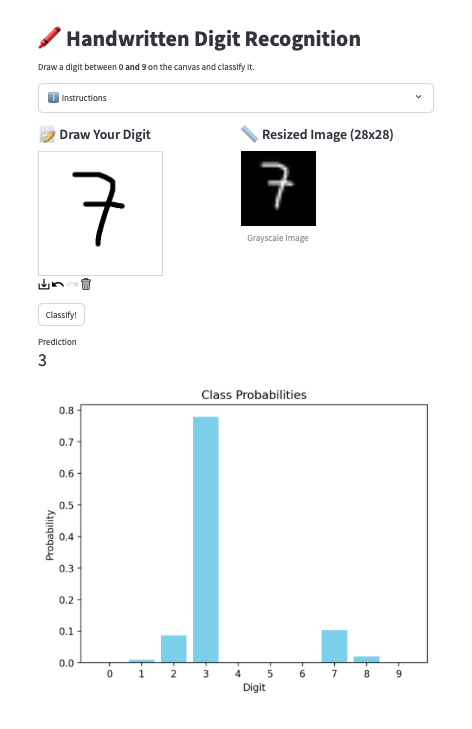

# **Handwritten Digit Recognition App 🖍️**

This project is a web-based application for recognizing handwritten digits (0-9). It consists of a **backend** powered by FastAPI that serves a pre-trained model for digit classification, and a **frontend** built with Streamlit, where users can draw digits and get predictions in real-time.

---

## **Table of Contents**
- [Demo](#demo)  
- [Features](#features)  
- [Architecture](#architecture)  
- [Setup Instructions](#setup-instructions)  
- [Usage](#usage)  
- [Directory Structure](#directory-structure)  
- [Acknowledgments](#acknowledgments)  
- [License](#license)  

---

## **Demo**
  
Draw a digit between 0 and 9 on the canvas, click **Classify!**, and see the predicted label along with the class probabilities.

---

## **Features**
- **Canvas Drawing:** Users can draw digits on an interactive canvas.
- **Backend Prediction:** FastAPI backend serves a trained Keras model for predictions.
- **Visualization:** Real-time bar chart showing probabilities for each digit class.
- **Responsive UI:** Clean and intuitive Streamlit-based interface.

---

## **Architecture**
- **Frontend:** Streamlit app with an interactive canvas.
- **Backend:** FastAPI serving a TensorFlow/Keras model for digit classification.
- **Model:** A CNN trained on the MNIST dataset to recognize digits from 0 to 9.

---

## **Setup Instructions**

### **1. Clone the Repository**
```bash
git clone https://github.com/didier-gamboa/digit-recognition-app.git
cd digit-recognition-app
```

### **2. Create Conda Enviroment**
```bash
conda env create -f ./env/environment.yaml
conda activate digit-recognition
```
### **2. Start the application**
Run both the backend and frontend using the `main.py` launcher:
```bash
python main.py
```

### **3. Usage**
1. Open the app in your browser (by default at http://localhost:8501).
2. Draw a digit (0-9) on the canvas.
3. Click Classify! to get the prediction.
4. View the predicted label and the probability distribution.

### **Directory Structure**
```
📂 my-digit-recognition-app/
├── 📂 backend/
│   ├── main.py                # FastAPI backend entry point
│   ├── models/
│   │   └── ocr_model.h5       # Saved Keras model
├── 📂 frontend/
│   ├── app.py                 # Streamlit frontend entry point
│   └── assets/                # Optional resources (e.g., screenshots)
├── 📂 env/
│   └── environment.yaml       # Conda environment configuration
├── .gitignore                 # Ignore unnecessary files
├── README.md                  # Project documentation
└── main.py                    # Launcher script for backend and frontend
```